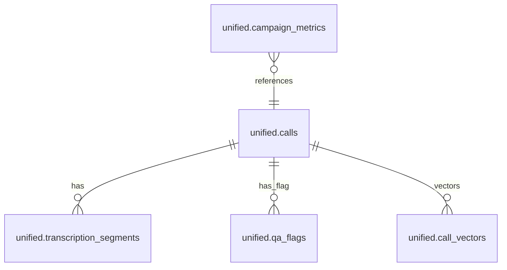

# CallScript.io Specification

This is the detailed specification for CallScript.io—defining **what** we’ll build, **how** each part should behave, and the **acceptance criteria** for each feature.

---

## 1. Functional Requirements

### 1.1 Call Ingestion
- The system must support ingesting call data from Ringba, TrackDrive, and other platforms via API.
- Ingestion must handle pagination and rate limiting gracefully.
- Failed ingestion attempts should be retried with exponential backoff.

### 1.2 Audio Proxy & Storage
- Audio recordings must be securely downloaded and stored in DigitalOcean Spaces.
- Recordings must be compressed using FFmpeg to optimize storage.
- Metadata from audio files must be extracted and stored.

### 1.3 Chunked Transcription Pipeline
- The system must use Voice Activity Detection (VAD) to split audio into chunks.
- Transcription will be handled by WhisperX on RunPod GPUs.
- Transcribed segments must be stitched back together and stored in the `call_chunks` table.

### 1.4 AI Analysis
- The system will use GPT-4/Grok for summaries, sentiment scoring, and compliance flagging.
- Transcripts will be indexed for semantic search using pgvector.

### 1.5 Dashboard & Reports
- The dashboard will display real-time KPIs, including call volume, revenue, and RPC.
- The system will provide interactive charts and heatmaps for performance analysis.
- Real-time alerts will be generated for anomalies and compliance breaches.

### 1.6 Authentication & Authorization
- The system will use JWT-based authentication with role-based access control (admin/viewer).
- Session management will include support for refresh tokens.

---

## 2. User Stories & Acceptance Criteria

| User Role | User Story | Acceptance Criteria |
|---|---|---|
| **Performance Marketer** | As a marketer, I want to track RPC and conversion rates across campaigns so I can optimize my ad spend. | - Dashboard shows RPC per campaign. - Data is updated in near real-time (<30s). - Can filter by date range and campaign. |
| **Call Center Manager** | As a manager, I want to monitor agent talk-time and sentiment to improve performance. | - Call detail page shows talk-time analytics. - Sentiment score is displayed for each call. - Can search for calls with negative sentiment. |
| **Compliance Officer** | As an officer, I want to receive real-time alerts for compliance violations. | - Email/SMS alert is sent for compliance flags. - Alert includes link to the call and transcript. - Flagged sections are highlighted in the transcript. |

---

## 3. API Specification

### 3.1 `POST /api/sync/ringba`
- **Request**:
  - `startDate` (optional, ISO string)
  - `endDate` (optional, ISO string)
- **Response**:
  - `status`: "success"
  - `processed`: number of records processed
  - `revenue`: total revenue
- **Errors**:
  - `400`: Invalid date range
  - `500`: Internal server error

### 3.2 `POST /api/audio/proxy`
- **Request**:
  - `callId`: ID of the call to proxy
- **Response**:
  - `url`: Signed URL to the audio file
- **Errors**:
  - `404`: Call not found
  - `500`: Storage error

---

## 4. Data Model Specification

- **Table Definitions**:
  - *(Refer to Database Schema Overview page for detailed column definitions.)*

---

## 5. UI Wireframes & Flows

- **Onboarding Flow**:
  - Step 1: Sign up
  - Step 2: Connect platform (e.g., Ringba)
  - Step 3: View dashboard
- **Main Layout**:
  - Sidebar navigation
  - Main content area with KPI cards and charts
- **Design System**: See the **Design System** page for component specs, tokens, and live examples.

---

## 6. Non-Functional Requirements

| Requirement | Specification |
|---|---|
| **Performance** | API response time < 200ms (p95) |
| **Scalability** | Handle 10,000 concurrent calls |
| **Security** | All sensitive data encrypted at rest and in transit |
| **Reliability** | 99.9% uptime |

---

## 7. Integration Details

- **Ringba**: See `docs/integration/details.md`
- **TrackDrive**: See `docs/integration/details.md`
- **RunPod**: API key authentication, webhook for job completion
- **DigitalOcean Spaces**: S3-compatible API with access keys

---

## 8. Deployment & CI/CD

- **Branch Strategy**: GitFlow (main, develop, feature branches)
- **Release Tags**: `vYYYY.MM.DD`
- **CI Workflow** (`.github/workflows/ci.yml`):
  - Run tests on every push to `develop`
  - Build Docker images
- **Deploy Workflow** (`deploy.yml`):
  - Deploy to staging on merge to `develop`
  - Deploy to production on merge to `main`

---

## 9. Metrics & Monitoring

- **Logging**: Pino (API & Workers) → Logflare; structured JSON logs with request IDs
- **Metrics**: Prometheus-compatible metrics at `/metrics`, visualized in Grafana (optional)
- **Error Tracking**: Sentry for unhandled exceptions and performance traces
- **Uptime**: DigitalOcean UptimeRobot pinging `/api/health` every 30s